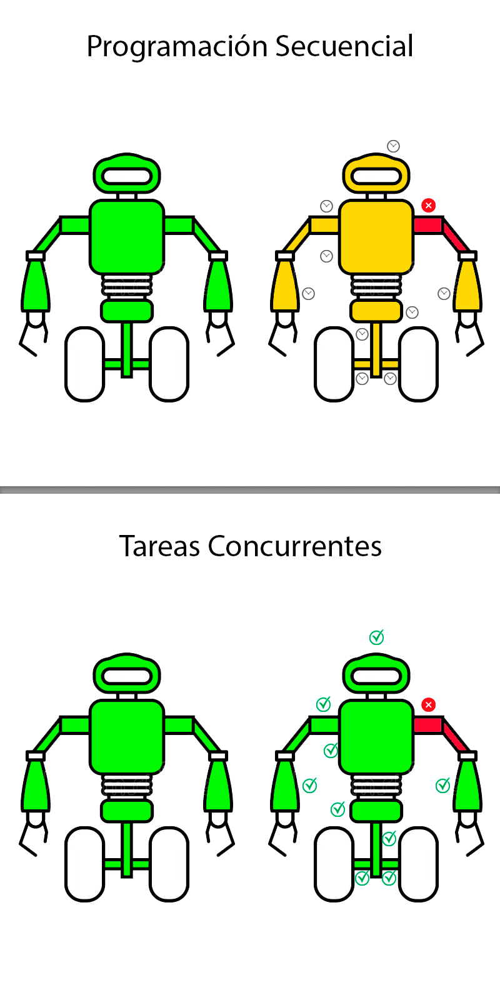

# Libreria freeRTOS

Ejemplo de uso de la libreria FreeRTOS para arduino en una placa ESP32.


## Tabla de contenidos:

-[Características de freeRTOS](#características-de-freertos)

-[Configuración inicial](#configuración-inicial)

-[Componentes clave](#componentes-clave)

-[Consideraciones](#consideraciones)

-[Ejemplo práctico](#ejemplo-práctico)

## Características de freeRTOS

Cuando se utiliza FreeRTOS en Arduino, se reemplaza el modelo simple de programación secuencial con un enfoque basado en tareas concurrentes. Esto resulta útil en proyectos donde se requieren múltiples procesos simultáneos, como leer sensores, controlar motores y gestionar comunicaciones.

1. Planificación de tareas: Soporta la ejecución de múltiples tareas en paralelo mediante un planificador de prioridades.
2. Gestión de memoria: Permite la asignación dinámica y estática de memoria.
3. Sincronización: Proporciona herramientas como semáforos, mutexes y colas para la comunicación y sincronización entre tareas.
4. Temporizadores: Soporte para temporizadores de software para gestionar eventos de tiempo.
5. Interrupciones: Integración con manejadores de interrupciones para sistemas embebidos.
6. Escalabilidad: Adecuado para aplicaciones pequeñas y grandes, ajustando la memoria y características según las necesidades.

## Configuración inicial

### 1. Instalación:

- La biblioteca FreeRTOS está disponible en el Administrador de Bibliotecas de Arduino. Puedes instalarla desde el IDE de Arduino:
  1. Ve a **Herramientas > Administrar Bibliotecas.**
     Busca FreeRTOS y selecciona la opción que mejor se adapte a tu hardware (por ejemplo, ESP32 ya tiene soporte integrado para FreeRTOS).
  2. Busca **FreeRTOS** y selecciona la opción que mejor se adapte a tu hardware (por ejemplo, ESP32 ya tiene soporte integrado para FreeRTOS).

### 2. Incluir la biblioteca:

```c++
#include <Arduino_FreeRTOS.h>
```

**Nota:** ESP32 ya tiene soporte integrado para FreeRTOS no es necesario incluirlo en el código del desarrollo.

## Componentes clave

1. **Tareas**: Las tareas son bloques de código que se ejecutan de forma independiente.

- Función principal: _xTaskCreate_ para crear tareas.

2. **Colas**: Utilizadas para la comunicación entre tareas.

```c++
QueueHandle_t queue = xQueueCreate(10, sizeof(int));
```

3. **Semáforos y Mutexes**: Herramientas para la sincronización de tareas y el acceso a recursos compartidos.

```c++
// Declaración del semáforo
SemaphoreHandle_t miSemaforo;

// Crear el semáforo binario
miSemaforo = xSemaphoreCreateBinary();
// Inicializar el semáforo
xSemaphoreGive(miSemaforo);

// Esperar el semáforo
if (xSemaphoreTake(miSemaforo, portMAX_DELAY) == pdTRUE) {
  Serial.println("Tarea 2: Semáforo tomado");
  // Realizar alguna acción
  delay(1000);
  // Liberar el semáforo
  xSemaphoreGive(miSemaforo);
  Serial.println("Tarea 2: Semáforo liberado");
}
```

4. **Timers**: Temporizadores de software que ejecutan tareas periódicamente.

```c++
// Crear el temporizador
miTemporizador = xTimerCreate(
  "MiTemporizador", // Nombre del temporizador
  pdMS_TO_TICKS(1000), // Período del temporizador en ticks (1000 ms)
  pdTRUE, // Temporizador de auto-reinicio
  (void *)0, // ID del temporizador (opcional)
  miCallback // Función de callback
);

// Iniciar el temporizador
if (miTemporizador != NULL) {
  if (xTimerStart(miTemporizador, 0) != pdPASS) {
    Serial.println("Error al iniciar el temporizador");
    }
  }
```

## Consideraciones

- **Hardware soportado:** No todas las placas Arduino son compatibles con FreeRTOS, ya que requiere una cierta cantidad de memoria y capacidad de procesamiento. Es más común en placas como ESP32, STM32 o SAMD21.

- **Impacto en memoria:** FreeRTOS consume más recursos que un programa secuencial típico, por lo que es importante optimizar las tareas y el uso de memoria.

- **Prioridades:** FreeRTOS permite asignar prioridades a las tareas para asegurar que las más críticas tengan más tiempo de CPU.

## Ejemplo práctico

Si estás desarrollando un robot que necesita moverse, leer sensores y comunicarse por Bluetooth al mismo tiempo, FreeRTOS puede ayudarte a dividir estas funcionalidades en tareas separadas, manteniendo la eficiencia y evitando bloqueos.



## ¿Cuántas tareas puede ejecutar?

### Factores principales que influyen:

- Cada tarea en FreeRTOS consume memoria RAM para su stack (almacenamiento de variables locales, contexto de ejecución, etc.).
- Cuando creas una tarea con FreeRTOS, defines cuánto espacio del stack necesita.
- FreeRTOS tiene un límite configurado por la macro configMAX_PRIORITIES (en FreeRTOSConfig.h) para la cantidad de tareas que pueden tener diferentes prioridades.
- Si tienes demasiadas tareas que consumen mucho tiempo de procesamiento, podrías experimentar problemas de rendimiento o inestabilidad.
- Si estás usando periféricos como UART, I2C, SPI o Wi-Fi, estos también consumen RAM y CPU, reduciendo los recursos disponibles para tareas adicionales.

### Ejemplo de referencia (Arduino Uno):

En un Arduino Uno, debido a su RAM limitada (2 KB), podrías ejecutar entre 2 y 4 tareas simples si cada una tiene un stack pequeño (por ejemplo, 100 bytes). Sin embargo, esto también depende del uso de memoria por el sistema base y las bibliotecas.

### Ejemplo de referencia (ESP32):

En un ESP32, que tiene una memoria mucho mayor, podrías ejecutar decenas de tareas, dependiendo de los requisitos de memoria de cada tarea y de cómo optimices el uso de recursos.

-[Volver al inicio](#libreria-freertos)
